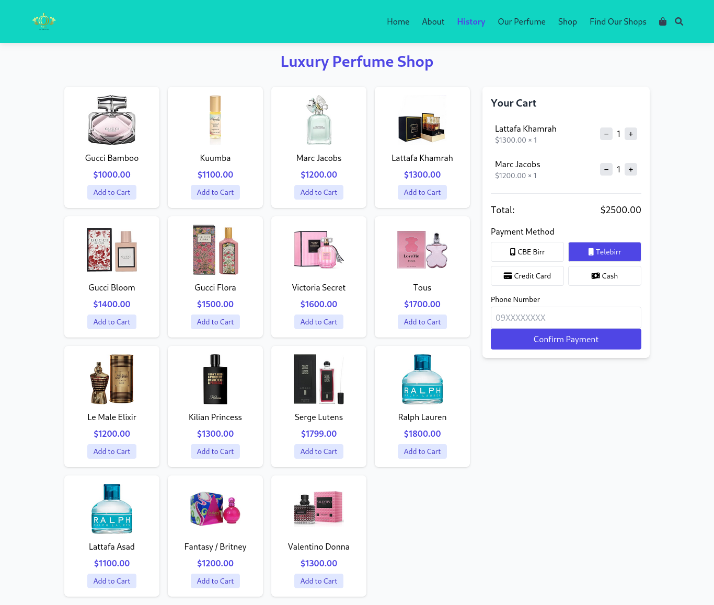

# Ethio Perfume Shop - README

## Project Overview

This repository contains the UI designs for Ethio Perfume Shop, an e-commerce platform specializing in luxury fragrances. Below are explanations of each page with embedded images.

## Pages

### 1. Login Page
  
The login page provides a simple authentication interface where users can sign in with their email and password or create a new account.

### 2. Homepage
  
The homepage introduces the brand with key sections including featured perfumes, top exporting countries, and contact information. It maintains a clean, product-focused design.

### 3. About Page
  
This page shares the shop's story, mission, and introduces the team members (though there appears to be placeholder text for team bios that needs updating).

### 4. History Page
  
A detailed look at the ancient origins of perfumery, including historical production methods and key ingredients used throughout history.

### 5. Perfume Page
  
Displays the perfume collection with price points in Birr (Ethiopian currency), emphasizing that fragrance choice is a personal expression.

### 6. Shop Page
  
The e-commerce interface showing available perfumes with prices in USD, a shopping cart, and multiple payment options including local Ethiopian payment methods.

### 7. Find Us Page
  
Lists physical shop locations worldwide and repeats some product information. Contains some placeholder text that needs review.

## Notes
- Some pages contain duplicate content or placeholder text that should be reviewed
- The team bios on the About page need individual descriptions
- Pricing appears in both Birr and USD across different pages (should be standardized)
- Location contact information appears on multiple pages with slight variations
