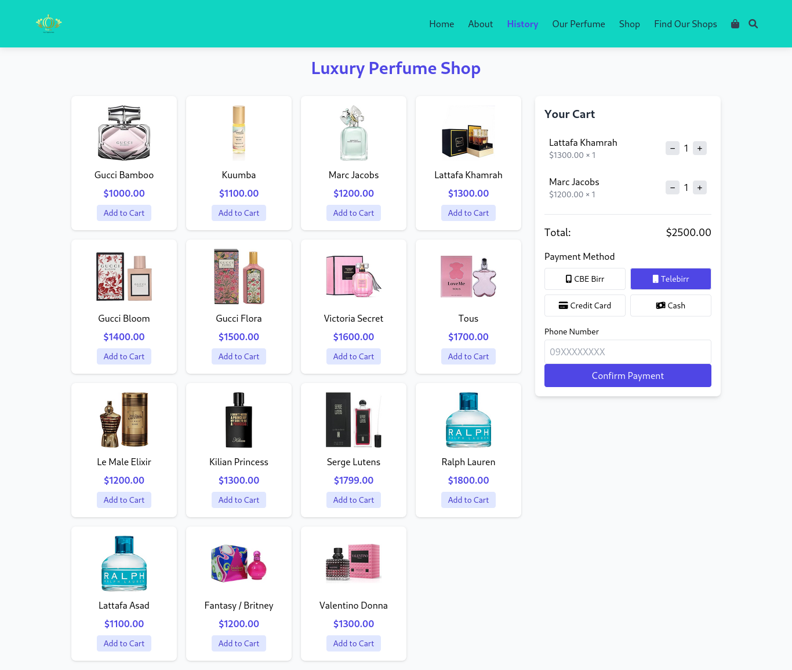

# 🌐 My Personal Website Projects

Welcome to my collection of website projects!  
Here, I showcase three websites I’ve built to practice my web development skills. Each website comes with a short video preview so you can see how it works in action.

---

## 📁 Website Projects

### 1. **[Perfume_Shop]**
🖥️ Description:  
_This repository contains the UI designs for  Perfume Shop, an e-commerce platform specializing in luxury fragrances. Below are explanations of each page with embedded images._

🎬 [Watch the video](https://youtu.be/j7DTllF8Vh8)

[Watch full video](img/2025-05-18%2014-37-59.mp4)

  

  

---

### 2. **[Website Name #2]**
🖥️ Description:  
_A short description of this second project (e.g., an online store, a gallery, etc.)._

🎬 [Watch the video preview](#link-to-video-2)

---

### 3. **[Website Name #3]**
🖥️ Description:  
_Another project with a short description (e.g., a contact form site, educational page, etc.)._

🎬 [Watch the video preview](#link-to-video-3)

---

## 🚀 Want to See More?

If you want to see more of my work, check out the links above or follow me for future projects!

---

📫 Feel free to reach out with feedback or suggestions.

Thank you for visiting!
